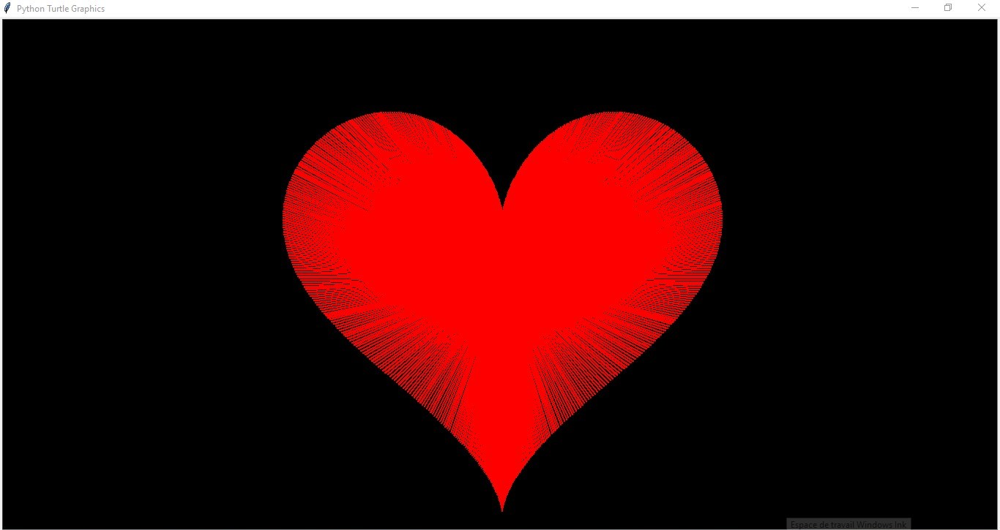

# Heart Drawing with Python Turtle


A beautiful heart drawing animation created using Python's Turtle graphics library. This project demonstrates mathematical parametric equations to generate a perfect heart shape with smooth animation.



## 📑 Table of Contents

- [About the Project](#-about-the-project)
- [Built With](#-built-with)
- [Prerequisites](#-prerequisites)
- [Installation](#-installation)
- [Usage](#-usage)
- [Configuration](#-configuration)
- [Testing](#-testing)
- [Deployment](#-deployment)
- [Contributing](#-contributing)
- [Roadmap](#-roadmap)
- [FAQ](#-faq)
- [License](#-license)

## 📖 About the Project

This project uses parametric equations to generate a perfect heart shape. The mathematical functions `hearta(k)` and `heartb(k)` define the x and y coordinates respectively, creating a smooth, continuous heart curve when plotted.

The animation draws the heart point by point (6000 points total), creating a mesmerizing effect as the shape gradually emerges on a black background. The project showcases the power of mathematical functions in computer graphics and provides a visually appealing result.

### Key Features:
- Smooth heart drawing animation
- Mathematical precision using parametric equations
- Customizable colors and drawing speed
- Clean, efficient code using Python standard libraries

## 🚀 Built With

-  - Primary programming language
-  - Graphics library for drawing
-  - Underlying GUI framework for Turtle

## 📋 Prerequisites

Before running this project, ensure you have the following installed:

- Python 3.6 or higher
- pip (Python package installer)

To check your Python version:
```bash
python --version
# or
python3 --version
```

## ⚙️ Installation

Follow these steps to set up the project locally:

1. **Clone the repository**
   ```bash
   git clone https://github.com/ahmedsabrari/heart-drawing.git
   cd heart-drawing
   ```

2. **Verify Python installation**
   ```bash
   python --version
   # Should show Python 3.6 or higher
   ```

## 🎯 Usage

Run the heart drawing animation with the following command:

```bash
python src/heart.py
```

The animation will start automatically and take a few minutes to complete (6000 points). You'll see a red heart gradually being drawn on a black background.

### Program Execution Flow:
1. Initializes the Turtle graphics window with a black background
2. Sets the pen color to red and adjusts the drawing speed
3. Iterates through 6000 points, calculating coordinates using mathematical functions
4. Draws each point while periodically returning to the origin
5. Keeps the window open after completion until manually closed

## 🔧 Configuration

You can customize the heart drawing by modifying these parameters in `src/heart.py`:

```python
# Change background color
bgcolor("white")  # Instead of "black"

# Change heart color
color("pink")     # Instead of "red"

# Adjust drawing speed (0 is fastest, 10 is normal)
speed(5)          # Medium speed

# Change heart size
x = hearta(i) * 15  # Smaller heart (instead of * 20)
y = heartb(i) * 25  # Larger heart (instead of * 20)

# Change number of points
for i in range(3000):  # Half the points for faster drawing
```

## 🧪 Testing

This project doesn't include formal unit tests as it's primarily a visual demonstration. However, you can verify it works correctly by:

1. Running the script and confirming the heart draws completely
2. Checking that the window opens and closes properly
3. Verifying no errors appear in the console

To perform a basic functionality test:
```bash
# Run the script
python src/heart.py

# Wait for completion (a few minutes)
# Verify a complete heart shape appears
```

## 📦 Deployment

For personal use, simply run the script as described in the Usage section.

To share with others:
1. Ensure they have Python installed
2. Share the project folder
3. Instruct them to run `python src/heart.py`

For packaging as an executable (optional):
```bash
# Install PyInstaller
pip install pyinstaller

# Create executable
pyinstaller --onefile --windowed src/heart.py
```

## 🤝 Contributing

Contributions are what make the open-source community such an amazing place to learn, inspire, and create. Any contributions you make are **greatly appreciated**.

1. Fork the Project
2. Create your Feature Branch (`git checkout -b feature/AmazingFeature`)
3. Commit your Changes (`git commit -m 'Add some AmazingFeature'`)
4. Push to the Branch (`git push origin feature/AmazingFeature`)
5. Open a Pull Request

### Development Guidelines:
- Follow PEP 8 style guide for Python code
- Add comments for new functions or complex logic
- Test your changes thoroughly
- Update documentation as needed

## 🗺️ Roadmap

See the [open issues](https://github.com/ahmedsabrari/heart-drawing/issues) for a list of proposed features (and known issues).

### Planned Enhancements:
- [ ] Multiple color options
- [ ] Interactive configuration menu
- [ ] Export to image functionality
- [ ] Animation speed control
- [ ] 3D heart rendering option

## ❓ FAQ

### Q: Why is the drawing so slow?
A: The script draws 6000 individual points to create a smooth curve. You can reduce the range in the loop for faster drawing.

### Q: Can I change the heart color?
A: Yes, modify the `color()` function parameter in the code to any supported color name.

### Q: The window closes immediately after finishing. How can I keep it open?
A: The `done()` function should keep the window open. If it's closing too quickly, you can add `input("Press Enter to exit...")` at the end.

### Q: How does the math work to create a heart shape?
A: The functions use parametric equations that combine sine and cosine waves at different frequencies to create the heart contour.

## 📝 License

Distributed under the MIT License. See `LICENSE` for more information.

## 🙏 Acknowledgments

- Inspired by mathematical parametric equations
- Built with Python's Turtle graphics library
- Heart equations based on standard mathematical formulas

---

⭐ Star this repo if you found it helpful!